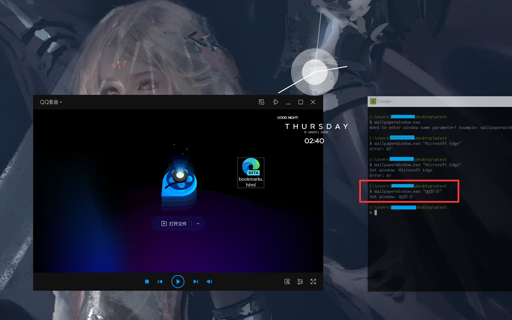

## 壁纸设置
Steam 上购买了 Wallpaper Engine，使用时感觉自定义渲染效果比较麻烦，于是编写这个程序。该程序可以将任意窗口放置到壁纸层(除微软应用有保护无法设置，如Edge, 计算器等)。

有了这个工具，自己可以编写一个Electron应用，渲染任意html页面在壁纸层。如动态壁纸，视频，游戏等。

```
WallpaperWindow.exe QQ影音
```


## 参考

https://www.codeproject.com/Articles/856020/Draw-Behind-Desktop-Icons-in-Windows-plus
https://github.com/NoisyWinds/Wallpaper